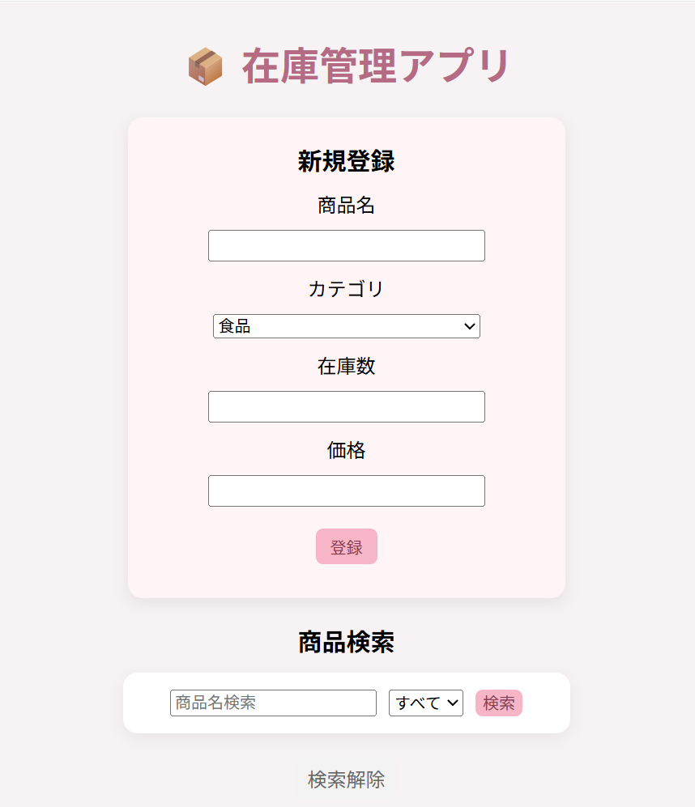
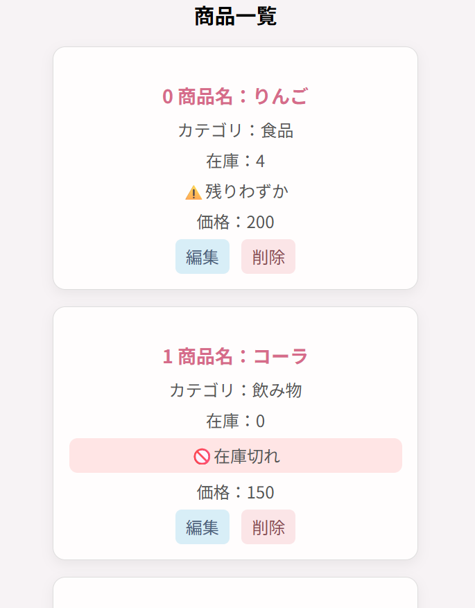

# 在庫管理アプリ

Flaskを使って作成した在庫管理アプリです。

商品情報を登録し、一覧で確認できます。
編集・削除・検索・カテゴリ絞り込みにも対応し、
在庫数が少ない商品や在庫切れの商品が分かりやすいように表示しています。

## 主な機能

‐ 商品の新規登録
‐ 商品情報の編集
‐ 商品の削除
‐ 商品名での検索
‐ カテゴリでの絞り込み
‐ 在庫数に応じたアラート表示
‐ 在庫5個以下：残りわずか
‐ 在庫0個：在庫切れ

## 使用技術

‐ Python
‐ Flask
‐ HTML&CSS
‐ Jinja2
‐ SQLite

## 工夫したところ

‐ 在庫に応じて「残りわずか」「在庫切れ」を表示
‐ 商品名検索とカテゴリ絞り込みを同時に使えるようにした
‐ 検索後も入力した文字や選択したカテゴリが残るようにした
‐ 登録・編集・削除を分かりやすく操作できるようにした
‐ 見やすくやわらかい配色UIを意識した
‐ テキスト保存からSQLiteに変更した
‐ 商品名・在庫数・価格の入力チェックを追加
‐ 入力エラー字にメッセージを表示
‐ エラー後も入力内容が残るようにした

## 起動方法

1.このリポジトリをダウンロードします2.必要なライブラリをインストールします
'''bash
pip install flask
''' 3.アプリを起動します
'''bash
python app.py
''' 4.ブラウザで以下にアクセスします
'''text
http://127.0.0.1:5000
'''

## スクリーンショット

### 登録・検索画面

### 商品一覧・在庫表示

